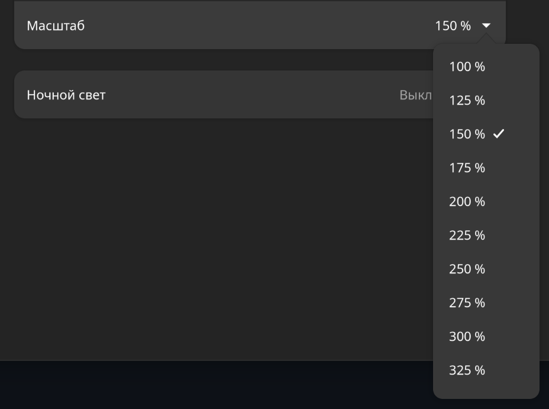

# Моя личная настройка GNOME (Wayland)

## Настройка дробного масштабирования
Данная функция актуальна для экранов с высоким разрешением (проблема HiDPI). Подробнее здесь: [Arch Linux Wiki](https://wiki.archlinux.org/title/HiDPI)
Для включения возможности дробного масштабирования (промежутные значения, 125%, 150% и т.д. вместо стандартных 100% и 200%):
```bash
gsettings set org.gnome.mutter experimental-features "['scale-monitor-framebuffer']"
```

Возможно понадобится перезапуск системы для появления новых масштабов в настройках (Настройки -> Дислпеи -> Масштаб)


Однако из-за данной экспериментальной функции некоторые приложения (в основном бразуры и web-подобные приложения на Electron, например, VSCode) могут стать заблюренными (мыльными).

## Исправление блюра для Google Chrome/Chromium
Необходимо найти флаг `chrome://flags/#ozone-platform-hint` и выбрать Wayland, после этого перезапустить браузер.

## Исправление блюра для VS Code
Необходим создать конфиг (при необходимости) `~/.config/code-flags.conf` и добавить следующие пункты:
```
--enable-features=UseOzonePlatform
--ozone-platform=wayland
```

## Shell
В качестве shell оболочки я использую [zsh](https://github.com/ohmyzsh/ohmyzsh/wiki/Installing-ZSH) (дефолтный в Manjaro Gnome) и [oh-my-zsh](https://ohmyz.sh/) с темой [powerlevel10k](https://github.com/romkatv/powerlevel10k) с плагинами [zsh-syntax-highlighting](https://github.com/zsh-users/zsh-syntax-highlighting) и [autoswitch_virtualenv](https://github.com/MichaelAquilina/zsh-autoswitch-virtualenv).

## Terminal
В качестве терминала я использую kitty с небольшим (пока что) конфигом и темой [Gruvbox](https://github.com/wdomitrz/kitty_gruvbox_theme).

